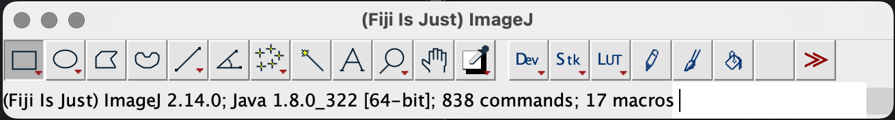
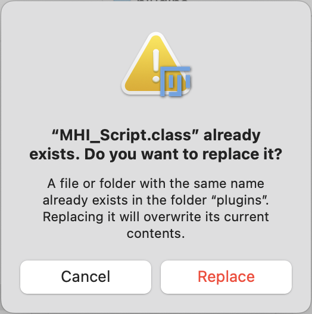
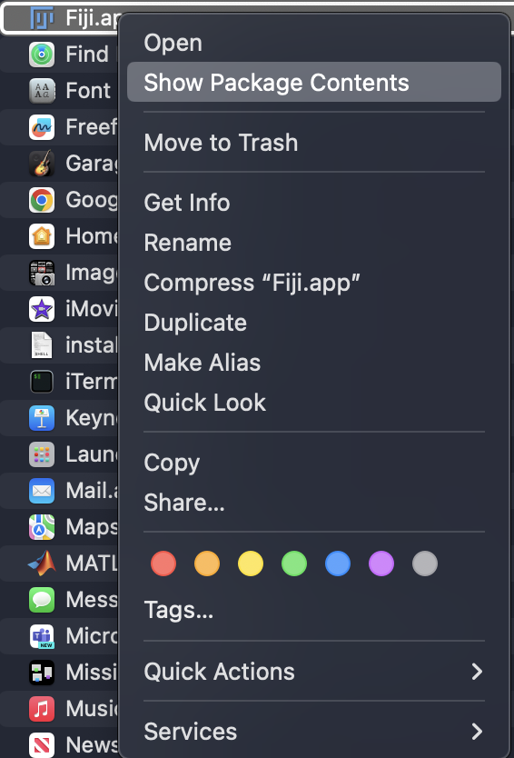
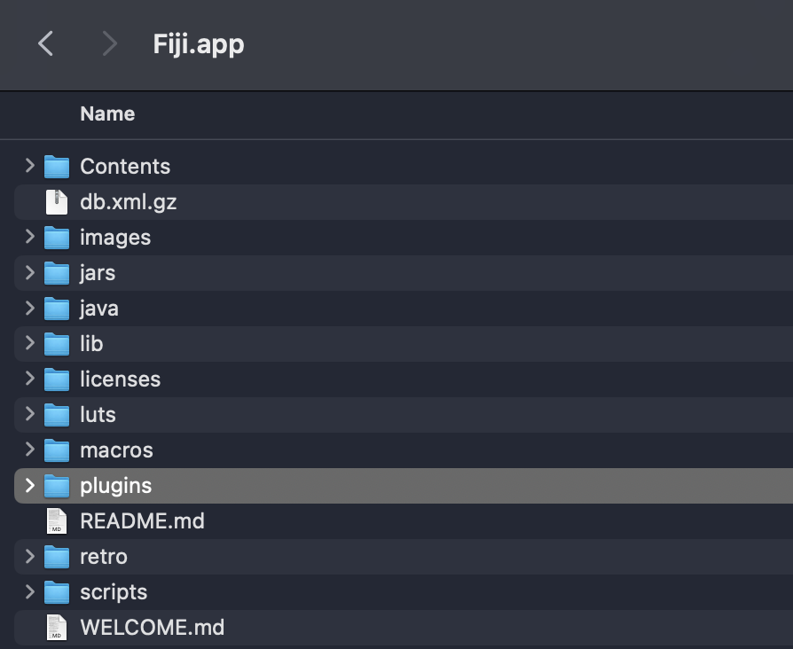
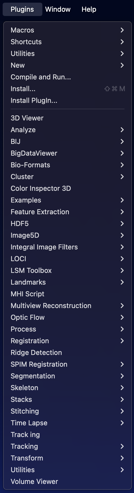

# Tracking Software

## Nadeau Group: Installing plugins to use with Fiji

- Download/pull the `.class` files from GitHub corresponding to the desired plugin(s).

There are two ways to import the `.class` files into Fiji:

**Drag and dropping**
This method allows you to keep the original files while automatically making duplicates to store in the `plugins` folder under `Fiji.app`.
1. Drag and drop one or all files into Fiji's GUI
     
     
2. If the class files have been installed previously, select "Replace". Note this will have to be done for each `.class` file that was imported.
     

3. Close and restart Fiji to load the imported Plugins

**Directly importing into Fiji's `plugins` Library**
This method moves the original files into `Fiji.app` under its Plugins folder, so it may be best to make duplicates to hold onto before moving files to Fiji.

1. Close/Quit Fiji if it's not closed already (it will have to be closed regardless in order to properly update its `plugins` library)

2. Locate Fiji's `plugins` folder. Right click on Fiji.app in your systems files (typically located under Applications), and select 'Show Package Contents':
     
        
3. The `plugins` folder should be right under the package contents folder. Drag and drop or download desired `.class` files to this folder. Please note again that this method does not create duplicates that allow you to keep working on without grabbing the files again from the `plugins` folder under `Fiji.app`
     1. *If the `.class` files exist already, you will be asked if you want to replace them*.
     
5. Restart Fiji

Plugins should now be ready to run and located in the dropdown menu under **Plugins**
    - In this example I imported `MHI Script` and `Track ing` which are now located here.
